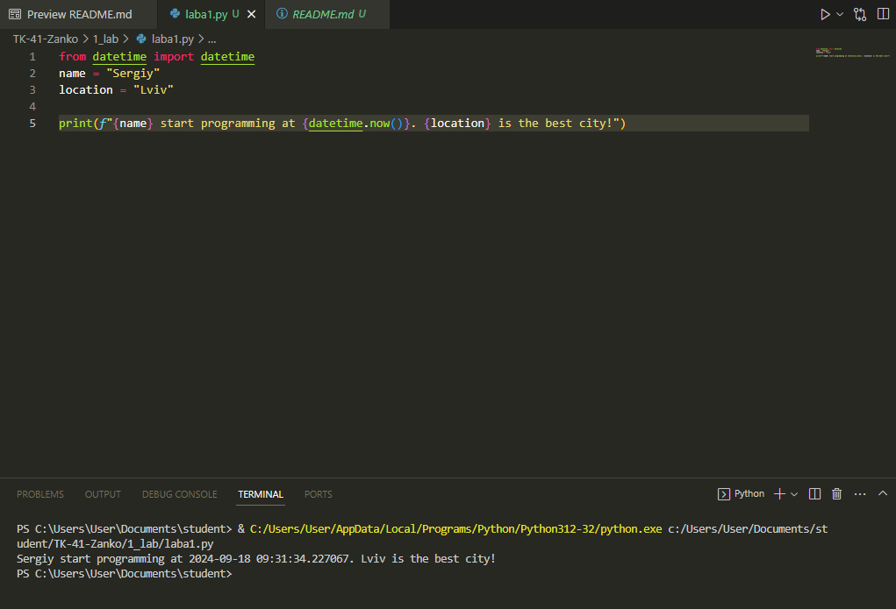
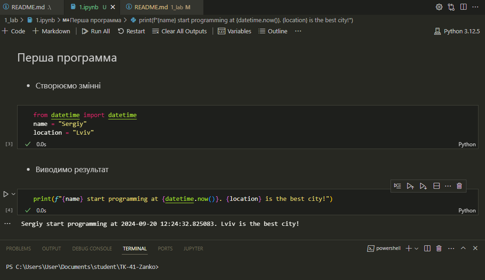
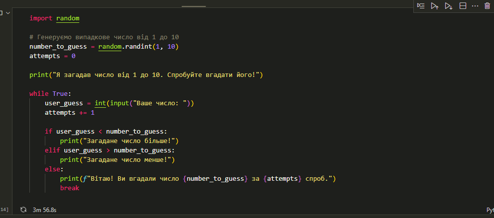

# Звіт до роботи №1
## Тема: _Вступ та оформлення робіт_
### Мета роботи: _Налаштувати локальне середовище розробки, створити Github репозиторій, оформлення робіт з використанням форматування Markdown_

---
### Виконання роботи
* Результати виконання завдань:
    1. Налаштували Visual Studio Code для роботи з Github;
    1. Створив репозиторій [ТК-41-Zanko](https://github.com/ssereegga/TK-41-Zanko);
    1. Попрацювавав з форматуванням Markdown та заповнив початкову сторінку;
    1. Почав оформляти першу роботу:
        - створив [файл з розширенням py](./laba1.py) та скопіював текст програми та запустив саму програму.
        - Результат виконання програми представив на скріншоті
        
    1. Попрацював з комірками ipynb, та навчився розбивати роботу покроково на комірки:
        - створив [створив Пайтон ноутбук файл](./1.ipynb)
        - резултат виконання програми на скріншоті 

### Індивідуальне завдання з ChatGPT, отримано наступну відповідь:
 - я написав гру за допомогою ChatGPT, результат виконання в [папці](./1.ipynb);
 - cкріншот виконаного коду 

---
### Висновок:

1. :question: Що зроблено в роботі;
 - Під час роботи я встановив усі необхідні для виконання завдання роботи, та навчився працювати з Visual Studio Code, і комітити програми у Github.
2. :question: Чи досягнуто мети роботи;
 - Так, я виконав усі поставлені завдання.
3. :question: Які нові знання отримано;
 - Я отримав навички роботи з Visual Studio Code, Github та навчився працювати з ChatGpt.
4. :question: Чи вдалось відповісти на всі питання задані в ході роботи;
 - Так, я відповів на усі поставлені питання.
5. :question: Чи вдалося виконати всі завдання;
 - Так, всі завдання були успішно виконані.
6.  :question: Чи виникли складності у виконанні завдання;
 - Складності виникали, але я успішно знайшов їх рішення.
7. :question: Чи подобається такий формат здачі роботи (Feedback);
 - Так, мені подобається працювати з GitHub.
8. :question: Побажання для покращення (Suggestions);
 - Мене все повністю влаштовує, тому побажань немає.

---